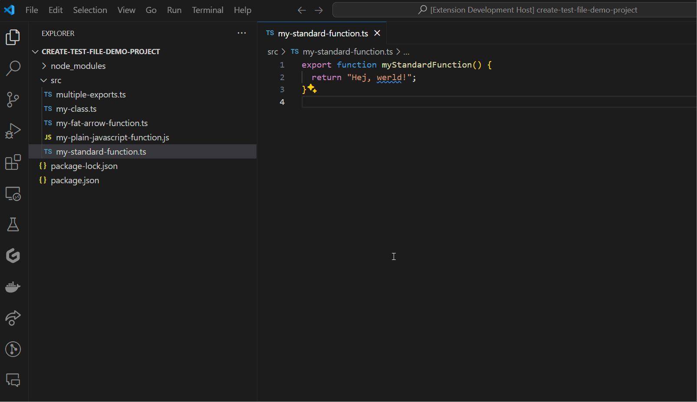

# Add Test README

Add Test is an extension that quickly adds a template test file for a javascript/typescript-module using either jest, vitest or mocha/chai. By right-clicking on a module and selecting Add Test this extension will analyze your file and create the appropriate, corresponding test file for your module. 

# Usage



# What?

Let's say that you have this file in your project:

```ts
// my-fat-arrow-function.ts
export const myFatArrowFunction = () => {
  return "Hello, World!";
};

```

If you right-click on the file that contains this module and select Add Test, the following file will be generated:

```ts
// my-fat-arrow-function.test.ts
import { myFatArrowFunction } from "./my-fat-arrow-function";
import { describe, it } from "mocha";
import { expect } from "chai";

describe("myFatArrowFunction", () => {
    it("should work", () => {
        expect(myFatArrowFunction()).not.toBeNull();
    });
});
```

Now, were you to use JavaScript instead of TypeScript, the appropriate extension will be used. And if you use jest instead of vitest, that will be imported. 

# Development

If you want to fork this, or contribute, just clone the repository and:

Install the dependencies
```bash
npm init
```

Then either run the dev watch:
```bash
npm run watch
```

Or just make your changes and, if you're running VS Code while developing this, _WHICH I REALLY SUGGEST YOU DO_, then press F5 to build and run it in a new instance of VS Code.

There are test files available in the ./test-suite-folder in this repo, you can use these to test various use-cases. And if you're missing a case, then new additions are always welcome!
