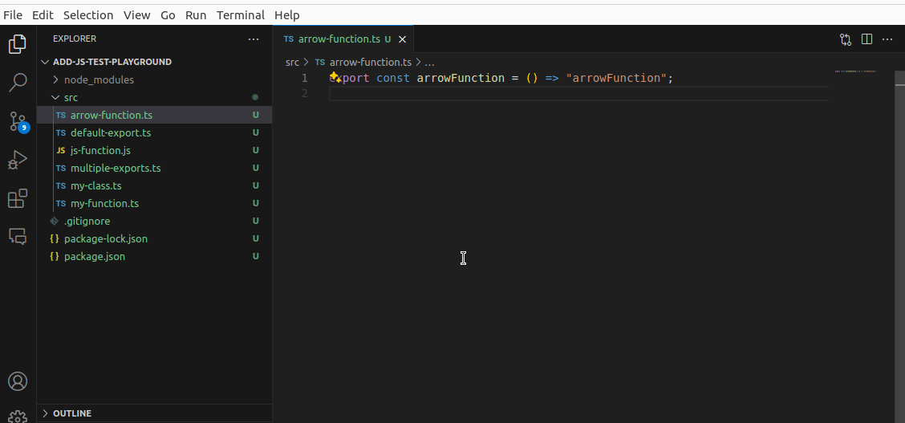
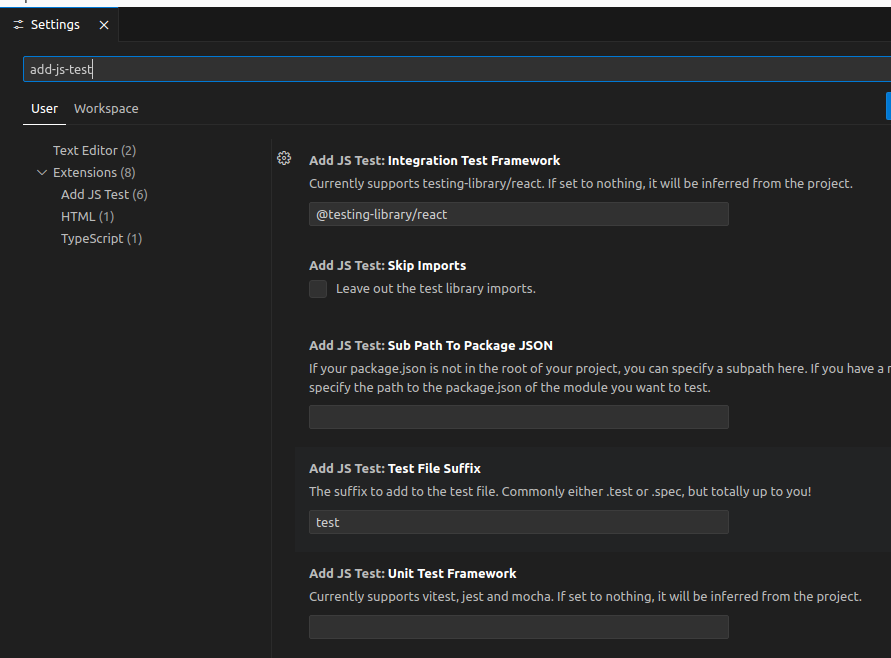
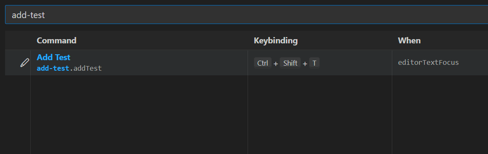

# Add JS Test README

Add JS Test is an extension that quickly adds a template test file for a javascript/typescript-module using either jest, vitest or mocha/chai. By right-clicking on a module and selecting Add JS Test this extension will analyze your file and create the appropriate, corresponding test file for your module.

In addition to standard unit tests the extension also supports adding tests for react components, mainly using @testing-library/react (but also Enzyme for legacy projects).

## Usage

<a href=".public/add-js-test-demo.gif" target="_blank"></a>

## What?

Let's say that you have this file in your project:

```js
// my-fat-arrow-function.ts
export const myFatArrowFunction = () => {
  return "Hello, World!";
};
```

If you right-click on the file in the explorer and select Add Test, the following file will be generated:

```js
// my-fat-arrow-function.test.ts
import { myFatArrowFunction } from "./my-fat-arrow-function";
import { describe, expect, it } from "vitest";

describe("myFatArrowFunction", () => {
  it("should work", () => {
    expect(myFatArrowFunction()).not.toBeNull();
  });
});
```

Now, were you to use JavaScript instead of TypeScript, the appropriate extension will be used. And if you use jest or mocha instead of vitest, that will be imported.

Likewise, if you have a JSX/TSX file that looks like this:

```js
// my-fat-component.ts
export const MyFatComponent = () => {
  return <h1>Hello, World!</h1>
};
```

Then you right-click on this file and select Add React Component Test and it will add a test similar to this:

```js
import { MyFatComponent } from "./my-fat-component";
import { render, screen } from "@testing-library/react";
import "@testing-library/jest-dom";

describe("should render", async () => {
  it("should render", () => {
    render(<MyFatComponent />);
    screen.debug();
  });
});
```

## Settings

By default, this extension will try to figure out which test framework to use by analyzing your package.json file. In case this file cannot be found, parsed or in other ways used, it will default to jest for unit tests and @testing-library/react for component testing.

If you, however, want to explicitly set which test framework to use, or have the files be called x.spec.ts instead of x.test.ts, these things are configurable in your settings. Just open VS Code Settings and search for add-js-test to view and edit them:

<a href=".public/settings.png" target="_blank"></a>

## Key bindings

The command is automatically bound to the short cut `ctrl+shift+t`, but can easily be changed by going to File -> Preferences -> Keyboard Shortcuts and search for add-js-test, this should give you this view:

<a href=".public/add-keyboard-shortcuts.png" target="_blank"></a>

To change this binding, right-click on the row and select `Change keybinding` and enter the new command you want.

## Development

If you want to fork this, or contribute, just clone the repository and:

Install the dependencies

```bash
npm init
```

Then either run the dev watch:

```bash
npm run watch
```

Or just make your changes and, if you're running VS Code while developing this, _WHICH I REALLY SUGGEST YOU DO_, then press F5 to build and run it in a new instance of VS Code.

There are test files available in the ./test-suite-folder in this repo, you can use these to test various use-cases. And if you're missing a case, then new additions are always welcome!

## Documentation

Here are some links to documentation that may be of assistance:

- Type documentation for babel: https://babeljs.io/docs/babel-types
- Basic VS Code extension development: https://code.visualstudio.com/api/get-started/your-first-extension
- More fundamentals: https://snyk.io/blog/modern-vs-code-extension-development-basics/
