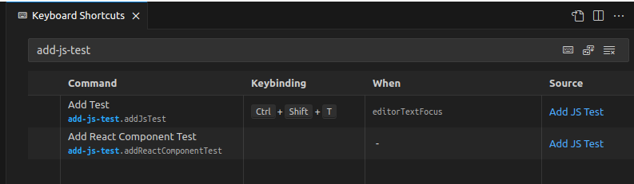

# Add JS Test README

Add JS Test is an extension that quickly adds a template test file for a javascript/typescript-module using either jest, vitest or mocha/chai. By right-clicking on a module and selecting Add JS Test this extension will analyze your file and create the appropriate, corresponding test file for your module.

# Usage


# What?

Let's say that you have this file in your project:

```ts
// my-fat-arrow-function.ts
export const myFatArrowFunction = () => {
  return "Hello, World!";
};
```

If you right-click on the file that contains this module and select Add JS Test, the following file will be generated:

```ts
// my-fat-arrow-function.test.ts
import { myFatArrowFunction } from "./my-fat-arrow-function";
import { describe, expect, it } from "vitest";

describe("myFatArrowFunction", () => {
  it("should work", () => {
    expect(myFatArrowFunction()).not.toBeNull();
  });
});
```

Now, were you to use JavaScript instead of TypeScript, the appropriate extension will be used. And if you use jest or mocha instead of vitest, that will be imported.

# Key bindings

The command is automatically bound to the short cut `ctrl+shift+t`, but can easily be changed by going to File -> Preferences -> Keyboard Shortcuts and search for add-js-test, this should give you this view:



To change this binding, right-click on the row and select `Change keybinding` and enter the new command you want.

# Development

If you want to fork this, or contribute, just clone the repository and:

Install the dependencies

```bash
npm init
```

Then either run the dev watch:

```bash
npm run watch
```

Or just make your changes and, if you're running VS Code while developing this, _WHICH I REALLY SUGGEST YOU DO_, then press F5 to build and run it in a new instance of VS Code.

There are test files available in the ./test-suite-folder in this repo, you can use these to test various use-cases. And if you're missing a case, then new additions are always welcome!

# Documentation

Here are some links to documentation that may be of assistance:

- Type documentation for babel: https://babeljs.io/docs/babel-types
- Basic VS Code extension development: https://code.visualstudio.com/api/get-started/your-first-extension
- More fundamentals: https://snyk.io/blog/modern-vs-code-extension-development-basics/
